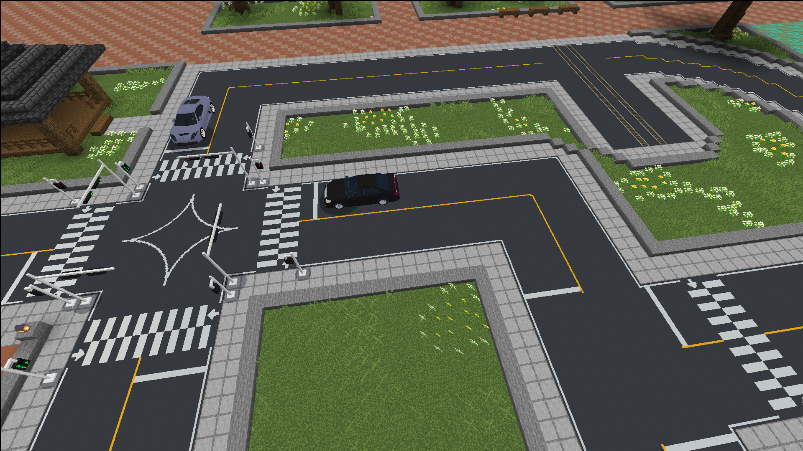

# Traffic Kor



Minecraft Bedrock용 한국형 도로 교통 애드온입니다. 차량 신호등, 보행자 신호등, 차선, 정지선, 횡단보도, 진행 방향 표시를 월드에 배치하고, 컨트롤러 엔티티로 신호 주기를 관리할 수 있습니다.

## 한국어

### 구성

- `development_behavior_packs/Traffic_Kor_BP`: 엔티티 동작, 아이템, 함수, Script API 로직
- `development_resource_packs/Traffic_Kor_RP`: 모델, 텍스처, 애니메이션, 언어 파일
- 최소 엔진 버전: Minecraft Bedrock `v26.21` (`min_engine_version`: `[1, 26, 21]`)

월드 설정에서 BP와 RP를 모두 활성화해야 정상적으로 작동합니다.

### 설치

개발 환경에서는 이 저장소를 `com.mojang` 폴더 아래에 둡니다.

```text
com.mojang/
  development_behavior_packs/
    Traffic_Kor_BP/
  development_resource_packs/
    Traffic_Kor_RP/
```

압축 파일로 받은 경우 `Traffic_Kor_BP`는 `development_behavior_packs`에, `Traffic_Kor_RP`는 `development_resource_packs`에 넣습니다.

### 가장 간단한 사용법

1. 월드 설정에서 `XK Traffic System KOR BP`와 `XK Traffic System KOR RP`를 활성화합니다.
2. 명령어를 사용할 수 있도록 치트를 켭니다.
3. 월드에 들어가 아래 명령어로 기본 도구를 한 번에 받습니다.

```mcfunction
/function traffic/give_tools
```

4. `Traffic Control Wand`로 교차로에 컨트롤러를 하나 설치합니다. 컨트롤러를 설치하면 새 그룹이 자동으로 선택됩니다.
5. 차량 신호등, 보행자 신호등, 차선, 정지선, 횡단보도 도구를 들고 블록 윗면에 사용해 배치합니다.
6. 컨트롤러 설치 후 배치한 신호등은 현재 선택된 그룹에 자동으로 연결됩니다.
7. `Traffic Control Wand`를 컨트롤러에 사용하면 신호 시간 설정 UI가 열립니다.

이 과정만으로 기본 교차로를 구성할 수 있습니다.

### 도구 동작

- 배치 도구: 블록 윗면에 해당 교통 엔티티를 배치합니다.
- 같은 배치 도구를 이미 설치된 같은 엔티티에 사용: 엔티티를 90도 회전합니다.
- 다른 배치 도구를 이미 설치된 교통 엔티티에 사용: 같은 위치에 새 교통 엔티티를 배치합니다.
- `Traffic Control Wand`: 컨트롤러 배치, 컨트롤러 신호 시간 설정 UI 열기
- `Group Manager Wand`: 컨트롤러 그룹 설정, 신호등 그룹 연결/해제, X/Z 축 변경
- `Remove Wand`: 교통 엔티티 제거. 왼쪽 클릭/공격으로 연결된 직선 차선 묶음을 한 번에 제거할 수 있습니다.
- `Road Signal Wand`: 차량 신호등 배치. 설치된 차량 신호등을 이 도구로 왼쪽 클릭/공격하면 신호등 모델이 순환됩니다.
- `Guideline Wand`: 가이드라인 배치. 설치된 가이드라인을 왼쪽 클릭/공격하면 크기/모델이 순환됩니다.
- `Stop Line Wand`: 정지선 배치. 설치된 정지선을 왼쪽 클릭/공격하면 텍스처 프레임이 순환됩니다.

### 차량 신호등 모델 바꾸기

차량 신호등은 하나의 `traffic:road_signal` 엔티티 안에 3가지 모델을 가지고 있습니다. 일반 모델을 설치한 뒤에도 다시 지우고 설치할 필요 없이 모델만 바꿀 수 있습니다.

1. `Road Signal Wand`를 손에 듭니다.
2. 이미 설치된 차량 신호등 엔티티를 조준합니다.
3. 왼쪽 클릭/공격합니다.
4. 채팅에 `Road signal model set to 1`, `2`, `3` 중 하나가 표시되며 모델이 바뀝니다.

모델은 `1 -> 2 -> 3 -> 1` 순서로 순환합니다. 1번은 기본 차량 신호등이고, 2번과 3번은 더 길게 뻗은 신호등 모델입니다. 큰 도로에서는 2번 또는 3번 모델을 사용하면 차로 중앙 쪽으로 신호등을 더 뻗어 보이게 할 수 있습니다.

### 컨트롤러 기본값

- X축 차량 초록불: 30초
- Z축 차량 초록불: 30초
- 차량 노란불: 4초
- 전체 빨간불: 2초
- X축 보행자 보행: 8초
- X축 보행자 카운트다운: 8초
- Z축 보행자 보행: 8초
- Z축 보행자 카운트다운: 8초

한 월드 안에 교차로를 여러 개 만들어도 됩니다. 교차로마다 `Traffic Control Wand`로 컨트롤러를 하나씩 설치하면 비어 있는 새 그룹 ID가 자동으로 배정됩니다. 예를 들어 첫 번째 교차로가 그룹 1이면, 다음 교차로는 보통 그룹 2로 잡힙니다.

주의할 점은 같은 차원 안에서 같은 그룹 ID를 가진 컨트롤러를 여러 개 두는 경우입니다. 이 경우 서로 다른 교차로가 아니라 같은 신호 그룹을 중복 제어하려는 컨트롤러로 취급되며, 중복 컨트롤러 이름표에 `DUP`가 표시됩니다. 떨어진 곳에 새 교차로를 만들 때는 컨트롤러와 신호등이 서로 다른 그룹 ID를 쓰도록 하면 됩니다.

### 참고사항

- 권장하는 도로 폭은 2차선 기준 9블록입니다. 7블록도 가능하지만 사용하는 차량 애드온에 따라 좁을 수 있습니다.
- 신호 주기가 느리게 보이면 컨트롤러와 신호등이 같은 교차로 근처에 있는지 확인하세요. 컨트롤러가 주변 신호를 갱신하는 구조라, 너무 멀리 떨어진 신호는 청크 로딩 상태에 따라 늦게 갱신될 수 있습니다.
- 차량 신호등 길이가 맞지 않을 때는 `Road Signal Wand`를 든 상태로 설치된 차량 신호등을 왼쪽 클릭/공격해 1번, 2번, 3번 모델을 순환해 보세요.

## English

### Overview

Traffic Kor is a Korean-style road traffic add-on for Minecraft Bedrock. It provides road signals, pedestrian signals, lane markings, stop lines, crosswalks, and direction markings that can be placed with wand items and controlled with in-world controller entities.

### Structure

- `development_behavior_packs/Traffic_Kor_BP`: entity behavior, items, functions, and Script API logic
- `development_resource_packs/Traffic_Kor_RP`: models, textures, animations, and language files
- Minimum engine version: Minecraft Bedrock `v26.21` (`min_engine_version`: `[1, 26, 21]`)

Both the behavior pack and resource pack must be enabled in the world.

### Installation

For development, keep this repository under your `com.mojang` folder.

```text
com.mojang/
  development_behavior_packs/
    Traffic_Kor_BP/
  development_resource_packs/
    Traffic_Kor_RP/
```

If you downloaded a zip, place `Traffic_Kor_BP` in `development_behavior_packs` and `Traffic_Kor_RP` in `development_resource_packs`.

### Quick Start

1. Enable `XK Traffic System KOR BP` and `XK Traffic System KOR RP` in your world settings.
2. Enable cheats so you can run function commands.
3. Join the world and run this command to receive the main tools at once.

```mcfunction
/function traffic/give_tools
```

4. Use the `Traffic Control Wand` to place one controller for the intersection. Placing a controller automatically creates and selects a group.
5. Use the road signal, pedestrian signal, lane, stop-line, and crosswalk wands on the top face of blocks to place traffic props.
6. Signals placed after a controller are automatically linked to the selected group.
7. Use the `Traffic Control Wand` on the controller to open the timing settings UI.

That is enough for the simplest working intersection.

### Wand Behavior

- Placement wands: place the matching traffic entity on the top face of a block.
- Same placement wand on the same placed entity: rotate the entity by 90 degrees.
- Different placement wand on an existing traffic entity: place the new traffic entity at the same position.
- `Traffic Control Wand`: place controllers and open the controller timing UI.
- `Group Manager Wand`: edit controller groups, link or unlink signals, and switch X/Z axis.
- `Remove Wand`: remove traffic entities. Left-hit can remove connected straight-line runs.
- `Road Signal Wand`: place road signals. Left-hit a placed road signal with this wand to cycle its model.
- `Guideline Wand`: place guidelines. Left-hit a guideline to cycle its size/model.
- `Stop Line Wand`: place stop lines. Left-hit a stop line to cycle its texture frame.

### Switching Road Signal Models

Road signals use one `traffic:road_signal` entity with three model variants. You do not need to remove and replace a signal to change its length.

1. Hold the `Road Signal Wand`.
2. Aim at an already placed road signal entity.
3. Left-hit/attack it.
4. Chat will show `Road signal model set to 1`, `2`, or `3`, and the model will change.

The models cycle in this order: `1 -> 2 -> 3 -> 1`. Model 1 is the default road signal, while models 2 and 3 are longer extended versions. Use model 2 or 3 on wider roads when the signal head needs to reach farther toward the lane center.

### Default Controller Timing

- X road green: 30 seconds
- Z road green: 30 seconds
- Road yellow: 4 seconds
- All red: 2 seconds
- X pedestrian walk: 8 seconds
- X pedestrian countdown: 8 seconds
- Z pedestrian walk: 8 seconds
- Z pedestrian countdown: 8 seconds

You can build multiple intersections in the same world. Place one controller per intersection with the `Traffic Control Wand`; each new controller automatically receives an unused group ID. For example, if the first intersection uses group 1, the next one will usually use group 2.

The important rule is to avoid multiple controllers with the same group ID in the same dimension. Those are treated as duplicate controllers for the same signal group, and duplicate controllers are marked with `DUP` in their name tag. For a separate intersection farther away, use a separate group ID for that controller and its signals.

### Notes

- The recommended road width is 9 blocks for a two-lane road. A 7-block width is also possible, but it may be narrow depending on the vehicle add-on being used.
- If signal changes appear slow, check that the controller is placed near the signals for that intersection. Controllers update nearby grouped signals, and far-away signals can update late depending on chunk loading.
- If a road signal does not reach far enough over the road, hold the `Road Signal Wand` and left-hit the placed signal to cycle through model 1, 2, and 3.

## License

This project is licensed under the GNU Affero General Public License v3.0. See [LICENSE](LICENSE).
